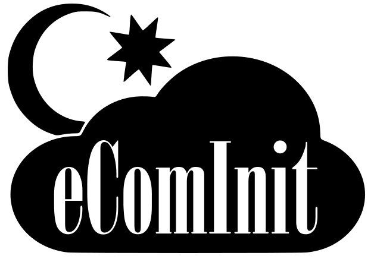
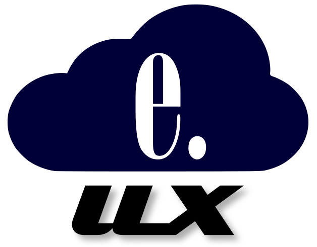

## Who We Are

eComCloud offers solutions built to enterprise-ready standards and designed
carefully according to software engineering best-practice. The eComCloud
philosophy is to combine two great traditions of software: Object-Oriented
Programming and the UNIX Way.

>Focus on just messaging - and realize that a good metasystem can
>late bind the various 2nd level architectures used in objects.
> -- <cite>Alan Kay</cite>

>This is the Unix philosophy: Write programs that do one thing and do it well.
>Write programs to work together. Write programs to handle text streams,
>because that is a universal interface.
> -- <cite>Peter H. Salus</cite>

<h2>eComInit</h2>

Expected release: Late 2021.

The first init system designed from the ground up for the age of cloud. When it
comes to service availability, there is no alternative which can hope to match
eComInit. With the flexible Service Object Model at your disposal, any service
regardless of semantics may benefit from the assurances eComInit provides. And
if you're a systemd shop, you'll enjoy the eComInit Subsystem for SystemD
Applications - which provides a libsystemd implementation and unit-file
upgrade to eComInit manifests.

<h2>e.UX</h2>

Expected release: 2022.

e.UX is our dependable operating system, directly derived from the original
AT&T UNIX&reg;. When there is no room to compromise on security and
reliability, e.UX gets the job done. Built on the solid foundations of
FreeBSD&reg;, extensive software and hardware support is ready from
first install, and the Linux&reg; Jails functionality lets
Linux&reg; apps run unmodified.

## Open Systems

We believe in open systems. That means more than bundling an inscrutable ball
of source code to our products. It means that we respect standards to the
highest degree, and where none exist, we create them in such a way as to make
their reimplementation simple. By this we protect our users' freedom of choice;
eComCloud aims to be a vendor of choice, not of compulsion.
